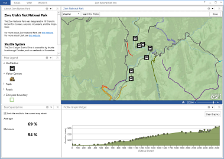

ProfileGraph-SearchFlickr-MultiSummary-opsdashboard-addin
=========================================================

An Operations Dashboard addin with a multi-value summary widget, a profile graph widget, a profile graph feature action, and a search photo map tool

## Features
 
* Multi-value summary widget 
* Profile graph widget
* Profile graph feature action 
* Search photos map tool

## Instructions

### Running this add-in
1. Ensure all requirements below are met.
2. Open and compile the addin project in Visual Studio 2012 or Visual Studio 2013.
3. Open the LoginInfo.cs file from the project. Replace the client_id and client_secret texts with yours. Replace the ApiKey and SharedSecret with yours.
4. Update Project Debug properties to correctly locate the add-in build path in /addinpath command line argument.
5. Run the project in Debug mode to start the Operations Dashboard application.
6. To use the multi-value summary widget, open an operation view that has a data source with at least one numeric field.
7. Add the multi-value summary widget. The widgets configuration window opens. Follow the on-screen instructions to configure the widget. Once the configuration is completed the widget is added to the operation view and displays your selected statistics.
8. To add the profile graph widget, click the “Draw Profile Line” button, start sketching a profile line on the map. Double-click to finish the sketch. A profile graph will be calculated for the sketched line and displayed in the widget. Click on the points on the graph to see the corresponding location on the map
9. Add the profile graph feature action (the profile graph widget is needed for this feature action). Right click on a line feature from the map to execute the feature action. The result profile graph will be displayed in the profile graph widget. 
10. Add the map tool and follow the on screen description to search for photos from Flickr. Pushpins are displayed on the map that correspond with the search results and a placeholder photo will be shown when you hover over a pushpin. You’ll need to modify the code to show the actual photo.
11. To run the addin in Release environment, build the project and upload the .opdashboardaddin file from the output directory to ArcGIS Online or your Portal for ArcGIS, then add the addin to an operation view through the Manage Add-ins dialog box. Repeat the steps above starting from step 7 to step 10 to configure and use the addin.

### General Help
[New to Github? Get started here.](http://htmlpreview.github.com/?https://github.com/Esri/esri.github.com/blob/master/help/esri-getting-to-know-github.html)

## Requirements
* An ArcGIS organizational account
* An installation of the Esri ArcGIS Runtime SDK for WPF version 10.2.3 [Esri website](http://resources.arcgis.com/en/communities/runtime-wpf/)
* An installation of Microsoft Visual Studio 2012/2013 Pro or above

## Resources

Learn more about Esri's [Operations Dashboard for ArcGIS](http://www.esri.com/software/arcgis/arcgisonline/features/operations-dashboard).

## Issues

Find a bug or want to request a new feature?  Please let us know by submitting an issue.

## Contributing

Esri welcomes contributions from anyone and everyone. Please see our [guidelines for contributing](https://github.com/esri/contributing).

## Licensing

Copyright 2014 Esri

Licensed under the Apache License, Version 2.0 (the "License");
you may not use this file except in compliance with the License.
You may obtain a copy of the License at

   http://www.apache.org/licenses/LICENSE-2.0
         
Unless required by applicable law or agreed to in writing, software
distributed under the License is distributed on an "AS IS" BASIS,
WITHOUT WARRANTIES OR CONDITIONS OF ANY KIND, either express or implied.
See the License for the specific language governing permissions and
limitations under the License.
                                 
A copy of the license is available in the repository's
[license.txt](license.txt) file.
                                                                  

                                                                                                               
                                                                                                                                                            
                                                                                                                                                            

